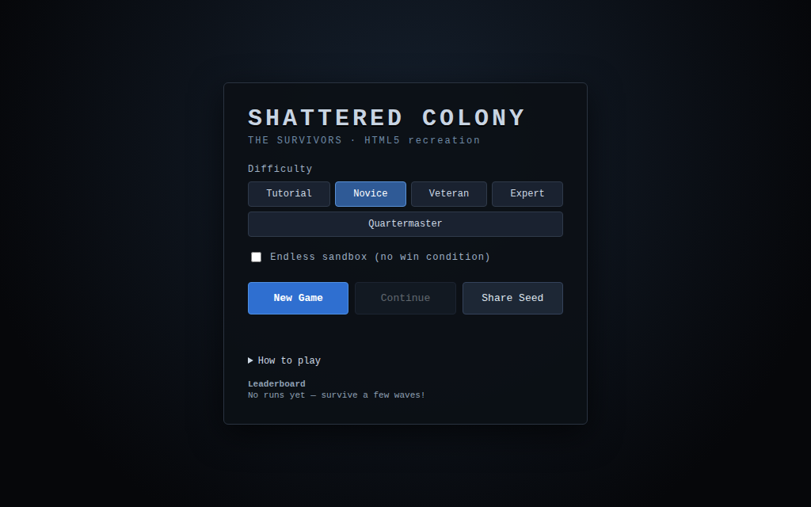
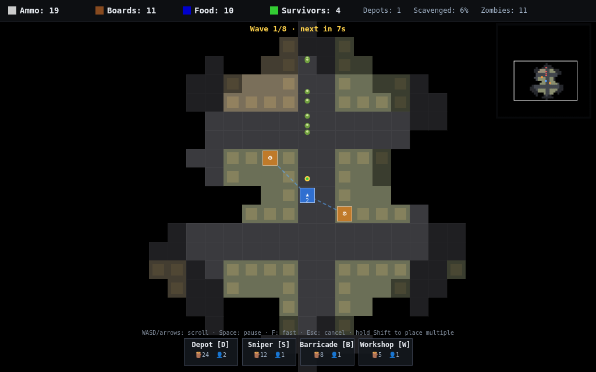

# Shattered Colony: The Survivors — HTML5 recreation

A playable, faithful recreation of the classic Flash real-time-strategy game
**Shattered Colony: The Survivors**, rebuilt from scratch in vanilla
JavaScript + HTML5 Canvas (no build step, no framework). Server-dependent
features (map sharing, leaderboards, analytics) are **mocked** so the game is
fully playable offline.

> This is a clean-room *gameplay* recreation. The original game's mechanics and
> balance constants were recovered by decompiling the provided `.swf`
> (a Haxe→Flash AS3 build), but **none of the original art, audio, or code is
> redistributed** here — all sprites are drawn procedurally on a canvas and all
> sounds are synthesised with the Web Audio API.



## Quick start

The game uses ES modules, so it must be served over HTTP (opening `index.html`
directly via `file://` won't work). The included zero-dependency mock server
does both jobs — static files **and** the mock API:

```bash
npm start          # -> http://localhost:8080
```

Then open <http://localhost:8080> in a browser. (Any static file server works
too, e.g. `python3 -m http.server`, but then the `/api/*` calls fall back to
`localStorage`.)

## How to play

You command the last survivors after a zombie outbreak. Your **Headquarters**
is your first depot. Survivors drive trucks of **boards**, **ammo** and **food**
between linked structures along supply lines.


*Workshops (orange) linked to the HQ by supply lines while a horde shambles in from the bridge.*

| Structure   | Cost            | Role |
|-------------|-----------------|------|
| **Workshop** | 🪵5 · 👤1       | Place on a building to scavenge resources (boards/ammo/food/survivors). |
| **Depot**    | 🪵24 · 👤2      | Extends your supply range (radius 7). Wall it in with barricades! |
| **Sniper**   | 🪵12 · 👤1      | Shoots zombies in range. Needs ammo + survivors to fire. |
| **Barricade**| 🪵8            | Blocks zombies; soaks each bash by spending a board. |

Zombies pour in from the **bridges** in escalating hordes (the flow field guides
them toward your depots; gunfire and construction noise lure them). An
undefended depot falls quickly and its survivors flee to the nearest depot — so
**barricades are your real defense**. Survive every wave and clear the city to
win; lose every depot and the colony falls.

### Controls

| Input | Action |
|-------|--------|
| `D` / `S` / `B` / `W` | Select Depot / Sniper / Barricade / Workshop to build |
| Left click | Build / select a structure |
| Right click / `Esc` | Cancel build mode or selection |
| Hold `Shift` while placing | Place multiple of the same structure |
| Arrow keys / screen-edge | Scroll the camera |
| Minimap click | Recenter the camera |
| `Space` | Pause |
| `F` | Fast-forward (5×, like the original) |
| `G` | Save game (localStorage) |
| `R` / `M` | Restart / back to menu (on the end screen) |

When a depot is selected you can toggle **Supply link** and then click another
depot to create (or remove) a manual supply route between them.

## Architecture

Pure ES modules under `src/`, designed so the simulation has no DOM
dependencies (it runs headless in the test suite):

| Module | Responsibility |
|--------|----------------|
| `config.js` | Balance constants ported from the original `Option.as`. |
| `util.js` | Seeded RNG (mulberry32), `Point`, directions, helpers. |
| `buildings.js` | Building catalogue + salvage profiles (from `salvageDistribution`). |
| `map.js` | Grid, cells, backgrounds, and procedural city generation. |
| `pathfinder.js` | Fog-of-war reveal, truck BFS pathfinding, zombie flow field. |
| `towers.js` | `Depot`/`HQ`, `Sniper`, `Barricade`, `Workshop` + resource model. |
| `actors.js` | `Truck` (survivor courier) and `Zombie`. |
| `game.js` | World state, simulation step, waves, build rules, win/lose, save. |
| `render.js` | Canvas world renderer (tiles, fog, towers, actors, supply lines). |
| `hud.js` | Resource bar, build menu, minimap, selection panel, pointer input. |
| `audio.js` | Web Audio synthesised sound effects. |
| `net.js` | Mock backend client (map share, leaderboard, save) with offline fallback. |
| `main.js` | Menu, fixed-timestep loop (20 fps), input, audio wiring. |

`server/mock-server.mjs` is a dependency-free Node HTTP server providing:

- `GET  /api/ping` — health check
- `POST /api/maps` → `{ code, url }` — share a seed/map, get a short code
- `GET  /api/maps/:code` — fetch a shared map
- `POST /api/scores` / `GET /api/scores` — mock leaderboard

If the server isn't reachable, `net.js` transparently falls back to
`localStorage`, so sharing and saving still "work" locally.

## Fidelity notes

Faithful to the original where it was recoverable from the decompiled source:

- 800×600-era top-down city on a 32px grid, 20 fps fixed timestep, 5× fast mode.
- Four resources (Ammo, Boards, Food, Survivors); `truckLoad` of 10 (survivors
  count individually); supply range of 7; map sizes & bridge counts per
  difficulty (`46→76`, `1→4` bridges).
- Workshops scavenge buildings using the original `salvageDistribution` weights
  (police → ammo, hardware → boards, hospital/apartment → survivors, …).
- Zombies shamble toward depots, are lured by loud noise, attack structures, and
  **turn killed couriers into new zombies** ("Turncoat").
- Snipers use the original accuracy model (base + survivor/food/vulnerable
  bonuses) and ammo cost per shot; barricades spend boards per bash.

Deliberately simplified or interpreted (the original is a much larger game with
a map editor, scripted campaign, replays and nine cities):

- **Build costs** — the decompiled cost tables are upgrade tables whose build
  slot is `0`, so exact build prices were ambiguous; the values above are tuned
  for the same economy feel.
- **Structure durability** — undefended towers fall fast (as in the original)
  but are given a few hit-points so a lone wanderer can't delete your HQ in a
  single frame before you react. Barricades remain board-based.
- Procedural sandbox/wave mode instead of the scripted story campaign and the
  in-game map editor.
- Vector MovieClip sprites and licensed music are replaced with canvas drawing
  and synthesised audio.

## Tests

```bash
npm run smoke        # headless simulation across all difficulties (no DOM)
node test/render-smoke.mjs   # exercises the canvas/HUD code paths with a stub ctx
```

The smoke test builds each structure type, runs thousands of frames, and asserts
world invariants (no negative resources, zombies spawn, trucks dispatch, saves
serialize, losing all depots ends the game).
